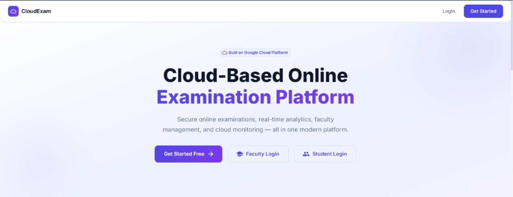
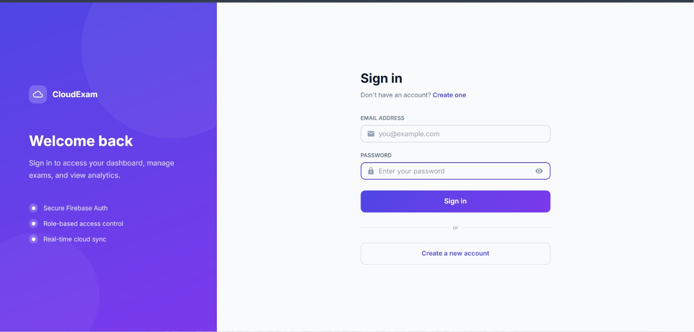
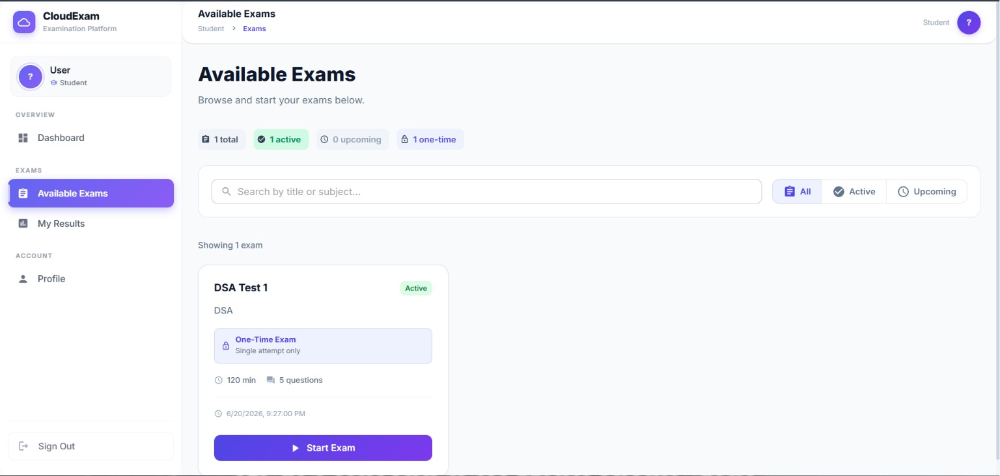
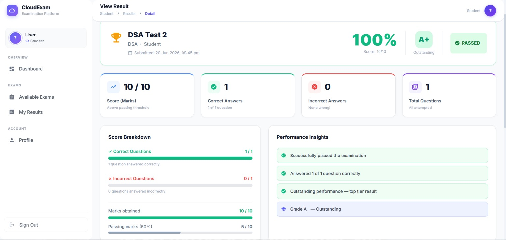
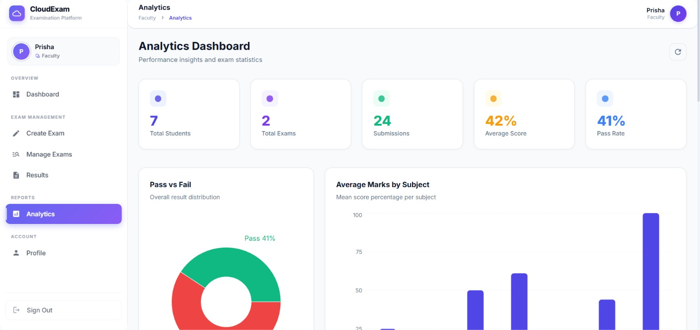

# Cloud-Based Online Examination & Analytics System

## Introduction

The Cloud-Based Online Examination & Analytics System is a web application developed to simplify the process of conducting examinations online. The system allows faculty members to create and manage exams, while students can securely attempt examinations from anywhere. After submission, results are evaluated automatically and analytics are generated to help faculty understand student performance.

This project was developed using React, Firebase, and Google Cloud Platform (GCP) as part of our Cloud Computing coursework. It demonstrates the use of cloud technologies such as serverless computing, cloud databases, authentication services, and analytics processing.

<h3>Home Page</h3>

---

## Problem Statement

Traditional examination systems often involve manual paper checking, result preparation, and performance analysis. These processes can be time-consuming and prone to errors.

The goal of this project is to provide a cloud-based solution that automates examination management, evaluation, and analytics while ensuring security and scalability.

---

## Features

### Faculty Features

* Create and manage examinations
* Add and update questions
* Assign marks to questions
* Schedule exams
* Monitor student performance
* View reports and analytics
* Access activity logs

### Student Features

* Register and log in securely
* View available examinations
* Attempt exams online
* Submit answers digitally
* View results instantly
* Track personal performance

---

## Technology Stack

### Frontend

* React.js
* React Router DOM
* Material UI (MUI)
* Recharts

### Backend & Database

* Firebase Authentication
* Cloud Firestore
* Cloud Functions Gen2

### Google Cloud Services

* Google Cloud Platform (GCP)
* Cloud Run
* Cloud Scheduler
* BigQuery
* Cloud Storage
* Cloud Build
* IAM

---

## System Architecture

<h2>System Architecture</h2>

---

## Cloud Concepts Used

This project helped us implement several cloud computing concepts, including:

* Serverless Computing
* Event-Driven Architecture
* Auto Scaling
* Cloud Databases
* Authentication Services
* Role-Based Access Control (RBAC)
* Data Warehousing
* Analytics Processing
* Cloud Security
* Pay-As-You-Go Computing

---

## Authentication and Security

The system uses Firebase Authentication to provide secure login and registration.

Two user roles are supported:

### Student

* Attempt exams
* View results

### Faculty

* Create and manage exams
* View analytics and reports

Role-based access control ensures that users can only access features assigned to their role.

---

## Database Structure

The application uses Cloud Firestore as its primary database.

### Main Collections

* users
* exams
* questions
* results
* auditLogs
* analytics_cache
* results_pending

These collections store user information, examination data, results, analytics data, and system activity logs.

<h3>Login Page</h3>

<h3>Available Exams Page</h3>

<h3>Results Page</h3>

<h3>Analytics Dashboard</h3>

---

## Working of the System

### Step 1: Exam Creation

Faculty members create examinations and add questions through the dashboard.

### Step 2: Exam Attempt

Students log in and attempt the examination within the specified schedule.

### Step 3: Evaluation

Submitted answers are processed through Cloud Functions, which automatically calculate scores and generate results.

### Step 4: Analytics

Result data is transferred to BigQuery, where analytics are generated and displayed through dashboards.

---

## Analytics Features

The analytics dashboard provides:

* Average marks
* Pass percentage
* Subject-wise performance
* Top-performing students
* Examination statistics
* Student activity insights

These analytics help faculty evaluate overall class performance more effectively.

---

## Future Enhancements

Some improvements that can be added in future versions include:

* AI-based online proctoring
* PDF result generation
* Email notifications
* Real-time monitoring dashboard
* Advanced subject-wise analytics
* Support for multiple institutions

---

## Team Members

* Sneha Bhundere
* Aryan Kelkar

---

## Conclusion

The Cloud-Based Online Examination & Analytics System demonstrates how cloud technologies can be used to build a scalable, secure, and efficient examination platform. The project combines modern web development with cloud services to automate examination management, result evaluation, and performance analysis.

---

## Academic Purpose

This project was developed as part of the Cloud Computing course to gain practical experience with cloud-native application development and Google Cloud Platform services.

